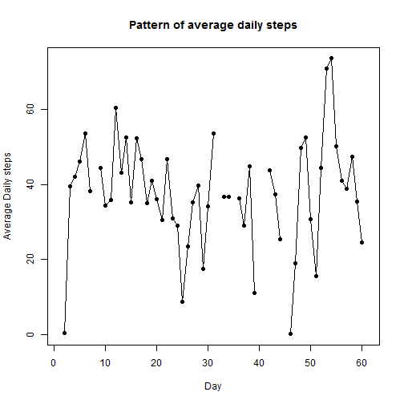

# Reproducible Research: Peer Assessment 1


## Loading and preprocessing the data
Repository comes with data compressed in file **activity.zip**.  Inside the zip archive, file **activity.csv** contains the data. It is possible to read fetch data directly in **data** dataframe without unarchiving the zip file:


```r
data <- read.csv(unz("./activity.zip", "activity.csv"))
```


## What is mean total number of steps taken per day?
Histogram of the total number of steps taken each day indicates the dataset includes days with "0" and/or NA entries.

```r
dailySteps <- tapply(data$steps, data$date, sum)
barplot(dailySteps, col = "blue", main = "Daily steps taken", ylab = "Daily steps", 
    xlab = "Day")
```

 


Mean and median calculations must therefore take into acount presence of NA's values.

```r
mean_result <- mean(dailySteps, na.rm = TRUE)
median_result <- median(dailySteps, na.rm = TRUE)
```


Above calcualations give output values:
- mean of total steps taken per day: 10766
- median of total steps taken per day: 10765

## What is the average daily activity pattern?
The pattern of average daily steps indicates most days are in the range of 30-50 steps:

```r
averageDailySteps <- tapply(data$steps, data$date, mean)
plot(averageDailySteps, type = "l", main = "Pattern of average daily steps", 
    ylab = "Average Daily steps", xlab = "Day")
points(averageDailySteps, pch = 19)
```

 


In order to identify which 5-minute interval, on average across all the days in the dataset, contains the maximum number of steps; data are reshaped in a table with **"interval"** in rows and **"date"** in columns:

```r
library(reshape2)
interval_table <- dcast(data, interval ~ date, value.var = "steps")
```


From **interval_table** new dataframe, vector of intervals with the maximum number of steps per each day is extracted and stored in **max_interval**, together with number of occurences in **max_days**:

```r
max_vect <- unlist(sapply(interval_table[, 2:62], which.max))
max_interval <- interval_table[names(which.max(table(max_vect))), "interval"]
max_days <- max(table(max_vect))
```

Code above leads to this result:
- In 4 (ie. "max_days") different days maximum number of daily steps occurs during interval 815 (ie. "max_interval")


Interval that in **hours:minutes** format is equivalent to 5 minutes interval starting from 13:35


## Imputing missing values
Count of NA's values gives the following result:

```r
sum(is.na(data$steps))
```

```
## [1] 2304
```


Strategy chosen to impute the missing values is replacing NA's value with the mean value of all the same 5-minutes intervals across all the days. Strategy is based on the assumption that number of steps take during the day are subject to a certain degree of *seasonality* during the 24 hours.

In order to fill the NA's with average values for intervals data are first subsetted exluding NA's. Then mean values for all intervals are calculate and stored in **avg_intervals**. Finally the new dataset **filled_data**, in which simulated data will be imputed, is created:

```r
subset_data <- subset(data, !is.na(data$steps))
avg_intervals <- tapply(subset_data$steps, subset_data$interval, mean)
filled_data <- data
```


Here below *for loop* loops over the new dataset and fills NA's with average values for 5-minutes interval.

```r
for (i in 1:length(filled_data$steps)) {
    if (is.na(filled_data$steps[i])) {
        interval <- filled_data$interval[i]
        filled_data$steps[i] <- avg_intervals[as.character(interval)]
    }
}
```


Histogram of the total number of steps taken each day is now.

```r
filledDailySteps <- tapply(filled_data$steps, filled_data$date, sum)
par(mfrow = c(2, 1))
barplot(filledDailySteps, col = "wheat", main = "Daily steps taken (simulated data)", 
    ylab = "Daily steps", xlab = "Day")
barplot(dailySteps, col = "blue", main = "Daily steps taken (original data)", 
    ylab = "Daily steps", xlab = "Day")
```

 


Mean and median calculations are now.

```r
filled_mean_result <- mean(filledDailySteps, na.rm = TRUE)
filled_median_result <- median(filledDailySteps, na.rm = TRUE)
```

Above calcualations give output values for **simualted data**:
- mean of total steps taken per day: 10766
- median of total steps taken per day: 10766

Recall that two above values for ** original data** were:
- mean of total steps taken per day: 10766
- median of total steps taken per day: 10765

## Are there differences in activity patterns between weekdays and weekends?
To answer this question, simulated data are enriched with two columns defining 
- the name of the day corresponding to date
- The type of day "weekend" or "weekday"


```r
library(lubridate)
filled_data$day <- wday(filled_data$date, label = TRUE, abbr = FALSE)
filled_data$day_type <- ifelse(filled_data$day == "Sunday" | filled_data$day == 
    "Saturday", "weekend", "weekday")
```


