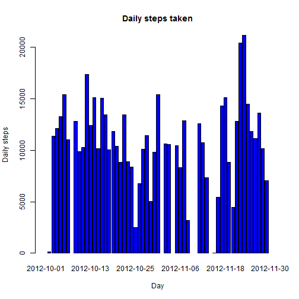

# Reproducible Research: Peer Assessment 1


## Loading and preprocessing the data
Repository comes with data compressed in file **activity.zip**.  Inside the zip archive, file **activity.csv** contains the data. It is possible to read fetch data directly in **data** dataframe without unarchiving the zip file:


```r
data <- read.csv(unz("./activity.zip", "activity.csv"))
```


## What is mean total number of steps taken per day?
Histogram of the total number of steps taken each day indicates the dataset includes days with "0" and/or NA entries.

```r
dailySteps <- tapply(data$steps, data$date, sum)
barplot(dailySteps, col = "blue", main = "Daily steps taken", ylab = "Daily steps", 
    xlab = "Day")
```

 


Mean and median calculations must therefore take into acount presence of NA's values.

```r
mean_result <- mean(dailySteps, na.rm = TRUE)
median_result <- median(dailySteps, na.rm = TRUE)
```


Above calcualations give output values:
- mean value for daily steps: 1.0766 &times; 10<sup>4</sup>
- median value for daily steps: 10765

## What is the average daily activity pattern?
The pattern of average daily steps indicates most days are in the range of 30-50 steps:

```r
averageDailySteps <- tapply(data$steps, data$date, mean)
plot(averageDailySteps, type = "l", main = "Pattern of average daily steps", 
    ylab = "Average Daily steps", xlab = "Day")
points(averageDailySteps, pch = 19)
```

 


Whilst the day with the maximum average of daily steps is:

```r
bestDay <- which(averageDailySteps == max(averageDailySteps, na.rm = TRUE))
averageDailySteps[bestDay]
```

```
## 2012-11-23 
##      73.59
```


## Imputing missing values
Count of NA's values give the following result:

```r
sum(is.na(data$steps))
```

```
## [1] 2304
```


## Are there differences in activity patterns between weekdays and weekends?
